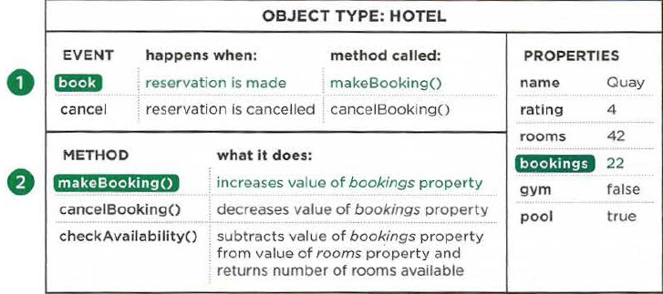

# 01. Programmeren

Javascript is een taal die ervoor zorgt dat browsers websites interactief kunnen maken, waardoor ze interessanter en gebruiksvriendelijker worden. jQuery, gelinkt aan Javascript, maakt het schrijven van Javascript, net iets makkelijker, maar dit valt niet binnen de inhoud van dit vak.

Eerst zal er dieper ingegaan worden op enkele basis concepten omtrent programmeren, en wordt de terminologie binnen Javascript uit de doeken gedaan. Vervolgens komt de taal zelf en zoals elke taal moet je eerst de woordenschat eigen maken en de manier waarop je de structuur van de zinnen opbouwt. Uiteindelijk zal er gekeken worden naar hoe Javascript vandaag de dag binnen websites gebruikt wordt.

Hoe maakt Javascript webpagina's interactiever?   
Javascript kan gebruikt worden om eender welk **element, attribuut of tekst te selecteren** binnen een HTML-pagina. Enkele voorbeelden:

* het selecteren van alle tekst van een h1 binnen een pagina
* het selecteren van eender welk element met een class attribuut met een waarde 'note'
* uitzoeken wat er werd ingevoerd in een tekstveld dat een id-attribute is met als waarde e-mail

Javascript kan gebruikt worden om eender welk **element, attribuut of tekst toe te voegen of te verwijderen** binnen een HTML-pagina. Enkele voorbeelden:

* het toevoegen van een paragraaf tekst na een `h1`
* het veranderen van de waarde van een class attribuut om zo nieuwe CSS-regels te laten gelden voor deze elementen
* de grootte of plaats van een afbeelding veranderen

Javascript kan binnen een HTML-pagina een '**programma laten draaien**'. De browser dient hiervoor een reeks stappen te volgen \(zoals een recept uit een kookboek\), waardoor de inhoud van de pagina aangepast of veranderd kan worden. Enkele voorbeelden:

* een script voor een galerij kan nagaan op welke afbeelding geklikt werd om vervolgens deze afbeelding groter weer te geven
* een script kan de afmetingen van je scherm nakijken en hierop beslissen dat een afbeelding onderaan het scherm wordt weergegeven \(beter gekend als 'viewport'\)

Javascript kan binnen een HTML-pagina **reageren op 'events'**. Een script kan in werking treden als een bepaalde handeling wordt uitgevoerd. Enkele voorbeelden:

* wanneer op een knop gedrukt wordt
* wanneer op een link geklikt wordt
* wanneer met een muis over
* wanneer informatie wordt toegevoegd aan een formulier 
* wanneer een tijdsinterval is verstreken 
* wanneer een webpagina is ingeladen

## Een script is een serie van instructies

Alvorens in Javascript te duiken is het belangrijk om enkele concepten binnen het programmeren eerst van dichterbij te bekijken.   
1. Wat is een script en hoe beginnen we eraan?   
2. Wat is de plaats van de computer in dit alles?   
3. Hoe schrijf ik een script voor een webpagina?

**Een script** is een series van instructies die een computer kan volgen om zo een vooropgesteld doel te bereiken. Script kunnen vergeleken worden met:

* recepten: 
  * stap per stap volgen 
  * eenvoudig recept of complete 3-gangen-menu 
  * indien nooit gekookt, eerst veel nieuwe terminologie te leren
* handboeken: 
  * procedures voor bepaalde situaties binnen bedrijven, vb. stappenplan bij inchecken hotel, brandprocedure,...
* handleidingen/manuals: 
  * handleiding bij auto indien er zich een probleem voordoet
  * wat te doen om dit probleem te verhelpen om nadien te hertesten om te zien of het probleem met de interventie werd opgelost

**Scripts** zijn een set van instructies die de computer stap voor stap dient te volgen. Een browser kan hierbij verschillende delen van het script gebruiken, afhankelijk van hoe de gebruiker interfereert met de inhoud van een bepaalde webpagina. Scripts kunnen verschillende stukjes code laten werken als antwoord op een gebeurtenis.

### Scripts schrijven

Om een script te kunnen schrijven moet je eerst een bepaald doel voor ogen hebben én een lijst van taken die moet vervuld worden om dit doel te kunnen bereiken.

In het dagelijkse leven maken we ontbijt, rijden met de auto of sturen een mail. Allemaal gewonen zaken waarmee we toen we ze voor de eerste keer uitvoerden een gedetailleerd lijst van instructies nodig hadden. Om iets nieuws te leren is het handig om te werken met een stappenplan en ons deze stappen eigen te maken. Als mens kunnen we dus redelijk complexe taken uitvoeren zonder daar hard over te moeten nadenken. Voor een computer is dit anders. Die heeft gedetailleerde instructies nodig om een taak tot een goed einde te brengen.

#### 1. Een doel definiëren

Eerst moet je definiëren wat je wil bereiken en het een doel beschrijven. Je kan het zien als een puzzel die de computer moet oplossen.

#### 2. Het script ontwerpen

Om een script te ontwerpen wordt het best opgesplitst in verschillende verschillende taken die uitgevoerd moeten worden om de puzzel op te lossen. Om dit te visualiseren kan een [flowchart](https://en.wikipedia.org/wiki/Flowchart) gebruikt worden. Dan kunnen de individuele stappen neergeschreven worden die de computer moet uitvoeren \(en de nodige info die hierbij komt kijken\) om zo elke taak apart tot een goed einde te brengen. Je kan het vergelijken met het neerpennen van een recept dat gevolgd dient te worden.

#### 3. Het script uitschrijven

Elke stap of taak moet neergeschreven worden in een programmeertaal die de computer verstaat. Binnen deze cursus kiezen we voor JavaScript. Het lijkt verleidelijk om direct te programmeren en het visualiseren over te slaan, maar uiteindelijk zal dit het werkproces versnellen.

Net zoals bij een gewone taal heb je in een programmeertaal enkele basisconcepten nodig:

* **woordenschat**: Om de stappen om te zetten in JavaScript is het nodig de juiste woordenschat te gebruiken, een taal die de computer verstaat.
* **syntax**: Tevens moet de juiste syntax gebruikt worden, dus de woorden moeten op een correcte manier tezamen gevoegd worden tot één geheel, zodat de computer de code verstaat en de instructies kan opvolgen.

Een computer is logisch en gehoorzaam en zal dus exact uitvoeren wat er in het script staat. Loopt er iets fout, dan zal een **analytische benadering** nodig zijn om problemen die zich mogelijk voordoen opgelost te krijgen.

In het begin zullen er meer fouten gemaakt worden bij het schrijven van scripts \(zelfs ervaren programmeurs maken fouten\). Je moet deze fouten dan gaan opsporen en corrigeren. Dit proces word door programmeurs **debuggen** genoemd. Je browser beschikt over krachtige debugging tools in de inspector om je hier bij te helpen.

### Programmatisch denken

Het is belangrijk bij het ontwerpen en schrijven van scripts dat je leert denken op de manier dat een computer denkt.   
Een computer lost problemen programmatisch op. Ze volgen de lijst met instructies die ze gekregen hebben exact. Het soort instructies dat een computer begrijpt, is ook beperkt. We zullen in deze cursus uitleggen welke instructies een computer begrijpt en hoe je met deze instructies problemen kan oplossen.

#### Voorbeeld

Je wil een script schrijven om te berekenen wat het maken van een naamplaatje kost. De klant betaalt hierbij een vaste prijs per letter. Eerst en vooral moet je nu het gewenste eindresultaat van je script bepalen. Wat wil je dat je script doet?  
De klant kan een naam op een plaatje laten zetten en per letter wordt 5 euro aangerekend. Wanneer de klant een naam ingevoerd heeft, krijgt hij een overzicht van de totaalprijs.

Het doel werd geformuleerd en wordt nu uitgesplitst in een reeks taken die uitgevoerd dient te worden:

1. Het script wordt gestart wanneer er op de submit-knop geklikt wordt.
2. Het script leest de naam van het tekstveld in.
3. Het script controleert of het veld van de naam niet leeg is. 
4. Als de klant niets heeft ingevuld, wordt er een een foutmelding weergegeven en wordt gevraagd alsnog een naam in te voeren.
5. Als er een naam werd ingevoerd het script verder afgewerkt worden.
6. Het aantal letters van de naam wordt geteld.
7. De kostprijs van het naamplaatje wordt berekend door het aantal letters in de naam te vermenigvuldigen met de kostprijs per letter. 
8. De totaalprijs wordt getoond aan de klant. 

## Modellen

Een computer benadert alles zeer abstract en maakt van alles **modellen** door het gebruik van data.   
Om dit te verduidelijken bekijken we een hotel. Een hotel wordt door een computer gezien als een verzameling **data** die gekoppeld kan worden, zoals een locatie, het aantal kamers, een rating,... De computer kent het begrip hotel niet, maar kan wel met de data van het hotel aan de slag.

## Objecten en properties \(eigenschappen\)

In een computer worden fysieke zaken uit het dagelijkse leven voorgesteld als een **object** met de nodige **eigenschappen**.   
Dit kan verduidelijkt worden door 'het object' auto als voorbeeld te nemen. Auto's hebben gemeenschappelijke eigenschappen, maar ook verschillen. Ze behoren tot een bepaald merk, hebben een bepaalde kleur, een bepaalde motor en als ze rijden hebben ze een af te lezen snelheid. Programmeurs benoemen deze karakteristieken 'de eigenschappen \(properties\) van een object'. 

Elke eigenschap \(property\) heeft een **naam** en een **waarde** \(value\).   
Enkele voorbeelden:

* Een auto is gelinkt aan een bepaald merk \(= naam\), bijvoorbeeld een BMW \(= waarde\). En deze auto heeft een bepaalde kleur \(= naam\), namelijk grijs \(= waarde\).
* Elk hotel heeft als belangrijke eigenschap een naam. De naam van een hotel is bijvoorbeeld 'Hilton Antwerpen' \(= waarde\). Dit hotel heeft als eigenschap dat het 210 \(= waarde\) kamers \(= naam\) ter beschikking heeft.

## Events \(gebeurtenissen\)

In het dagelijkse leven maken mensen gebruik van objecten. Door de menselijke tussenkomst of interactie kunnen de waarde van de eigenschappen van deze objecten wijzigen en dat noemen we **events**.  
Als voorbeeld keren we terug naar de auto. Tijdens het besturen van een auto wordt er gebruik gemaakt van minstens 2 pedalen, de gaspedaal en de remmen. De auto is dus ontworpen om op verschillende manieren te reageren, afhankelijk van de reactie van de bestuurder. Het induwen van de gaspedaal maakt dat de auto sneller gaat. Het gebruik van de remmen maakt dat de snelheid daalt. 

* object: auto
* event: 
  * vertragen \(gebeurt wanneer een bestuurder remt\)
  * versnellen \(gebeurt wanneer een bestuurder gas geeft\)
* object: hotel
* event: 
  * boeken \(gebeurt wanneer een reservatie gemaakt wordt\)
  * annuleren \(gebeurt wanneer een reservatie geannuleerd wordt\)

Soortgelijk aan bovenstaande voorbeelden worden computerprogramma's ontworpen om te reageren op verschillende zaken, afhankelijk van de input van de gebruiker. 

## Methoden

Methodes beschrijven dingen die mensen met objecten kunnen doen. Ze kunnen gezien worden als vragen en instructies die je bijvoorbeeld iets vertellen over een bepaald object \(door gebruik te maken van de informatie vervat in de eigenschappen\), of bijvoorbeeld de waarde van van een of meerdere eigenschappen van dat object doen veranderen. Een voorbeeld:

* object: auto
* method: 
  * changeSpeed\(\) \(dit verhoogt of verlaagt de waarde van de eigenschap _currentSpeed_\) 
* object: hotel
* method: 
  * makeBooking\(\) \(dit verhoogt de waarde van de eigenschap _bookings_\)
  * cancelBooking\(\) \(dit verlaagt de waarde van de eigenschap _bookings_\)
  * checkAvailability\(\) \(het aantal kamers van het hotel - de reeds geboekte kamers = het aantal nog beschikbare kamers\)



Aan elk object kunnen er dus eigenschappen \(properties\), methoden \(methods\) en gebeurtenissen \(events\) gekoppeld worden. Als we de auto als object zien, kan een auto de methoden 'start motor' en 'stop motor' hebben en de gebeurtenis 'stilgevallen'. 

## JS toevoegen

Zoals eerder vermeld worden scripts voor webpagina's geschreven in JavaScript. Dit is een programmeertaal die alle browsers begrijpen.

Net zoals HTML en CSS kan JavaScript gezien worden als tekst die op een bepaalde manier gestructureerd wordt. Er zijn dus geen extra tools nodig om scripts te maken.


#### Opmerking

Als je al eerder geprogrammeerd hebt in een taal zoals C\# of Java zal je opvallen dat JavaScript niet gecompileerd moet worden. Dit moet niet omdat de browser dit doet waneer het script geladen wordt. Op deze manier kan JavaScript op meerdere systemen functioneren. 


Er zijn 2 manieren om JavaScript te integreren in onze website: 

* met het `<script>`element
* met een extern `.js` bestand dat gelinkt wordt

### JS intern bestand

Je kan JavaScript schrijven binnen het `<script>` element van je HTML-bestand. Dit is net zoals bij CSS niet de aangewezen manier. 

```markup
<script>
    //Mijn klein stukje JavaScript
    let a = 1;
    let b = 2;
    alert( a + b );
</script>
```

### JS extern bestand

Maak in de map van de website een map `scripts` aan. Hierin worden de JavaScript-bestanden met de `.js` extensie geplaatst. Nadien kunnen de bestanden ingeladen worden in een webpagina, zoals hieronder vermeld met het `<script>` element.

```markup
<script src="./scripts/mijnScript.js">
```

