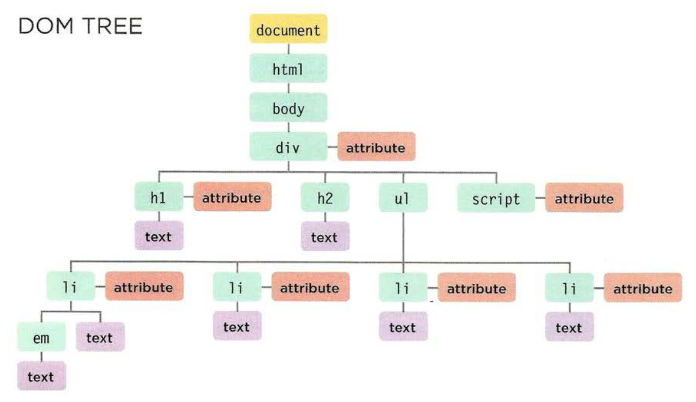

# 05. Document Object Model

Het Document Object Model \(of kortweg DOM\) bepaalt hoe een browser de HTML-pagina moet opbouwen en hoe JavaScript deze kan lezen en aanpassen.


Het DOM is geen onderdeel van HTML, noch van JavaScript. Het is een losstaande set van regels en wordt geïmplementeerd door elke browser.


Deze set van regels is onderverdeeld in 2 belangrijke onderdelen: 

* het opbouwen van een pagina \(tot de DOM tree\);
* het lezen en aanpassen van onderdelen op de pagina.

We noemen het een Document Object Model, omdat we de pagina gaan opbouwen vanuit het standpunt van objecten. Elk object staat voor een ander deel van de pagina die geladen werd in de browser. Het DOM bepaalt ook methoden en eigenschappen \(zoals een object\), waarmee we het document kunnen gaan manipuleren.

## DOM tree

Wanneer een browser een pagina inlaadt, maakt hij een _DOM tree_ aan. Hierin worden de verschillende objecten samen gezet die de pagina uitmaken. Deze _DOM tree_ bestaat uit 4 soorten van objecten/nodes:

* document node \(geel\);
* element node \(groen\);
* eigenschap node \(rood\);
* tekst node \(paars\).

 



## Werken met de DOM tree

Aanpassingen maken in de DOM tree bestaat uit 2 stappen: het selecteren van de node die je wil aanpassen en de eigenschappen of methoden ervan gebruiken om een verandering te maken.

```javascript
let elExample = document.getElementById('example');
elExample.textContent = "Nieuwe tekst";
```

### Parent

Een _parent_ is de node net boven de geselecteerde node. In de DOM tree in afbeelding 1 zien we 1 div-element staan. Het parent-element van deze div is body.

Je kan van een geselecteerd element altijd de parent selecteren, aangezien elk element maar één parent kan hebben.

```javascript
let elParent = elExample.parentNode;
```

### Child

In de andere volgorde kan je van een element ook het onderliggende element selecteren. Uiteraard kan een element meerdere child-elementen bevatten.

Een voorbeeld waarbij we het vierde element uit een opsomming verwijderen:

```javascript
let removeEl = document.getElementsByTagName('li ')[3]; //The element to remove
let containerEl = removeEl.parentNode; //The parent element
containerEl.removeChild(removeEl); //Removing the element
```

## HTML aanpassen

Er bestaan verschillende manieren om HTML aan te passen vanuit JavaScript. Elk van deze manieren heeft voor- en nadelen. Het is dan ook belangrijk het verschil te kennen om goed te kunnen beslissen welke manier je wanneer gebruikt.

### document.write\(\);

Met `document.write();` kunnen we heel eenvoudig nieuwe inhoud aan de pagina \(DOM\) toevoegen. Dit is echter een manier van werken die we zelden zullen adviseren. \(Let op! Werkt enkel in Firefox\)

<table>
  <thead>
    <tr>
      <th style="text-align:left">Voordelen</th>
      <th style="text-align:left">Nadelen</th>
    </tr>
  </thead>
  <tbody>
    <tr>
      <td style="text-align:left">
        <ul>
          <li>snel</li>
          <li>eenvoudig</li>
        </ul>
      </td>
      <td style="text-align:left">
        <ul>
          <li>werkt enkel tijdens het laden van de pagina</li>
          <li>Als je het nadien gebruikt, kan het:
            <ul>
              <li>de pagina overschrijven;</li>
              <li>niets toevoegen;</li>
              <li>een nieuwe pagina aanmaken.</li>
            </ul>
          </li>
        </ul>
      </td>
    </tr>
  </tbody>
</table>

try it yourself: [https://www.w3schools.com/js/tryit.asp?filename=tryjs\_output\_write](https://www.w3schools.com/js/tryit.asp?filename=tryjs_output_write)

### _element_.innerHTML = "";

Met de innerHTML-eigenschap kan je de volledige inhoud \(incl. markup\) van een node verkrijgen en aanpassen als een _string_.

<table>
  <thead>
    <tr>
      <th style="text-align:left">Voordelen</th>
      <th style="text-align:left">Nadelen</th>
    </tr>
  </thead>
  <tbody>
    <tr>
      <td style="text-align:left">
        <ul>
          <li>volledige inhoud verwijderen/aanpassen</li>
          <li>veel nieuwe markup toevoegen</li>
        </ul>
      </td>
      <td style="text-align:left">
        <ul>
          <li>groot risico voor XSS*</li>
          <li><em>event handlers</em> werken nadien mogelijk verkeerd</li>
        </ul>
      </td>
    </tr>
  </tbody>
</table>


**XSS**  
Cross-site scripting attacks zijn manieren om bepaalde data toe te voegen aan een website die daar niet thuis hoort. \(video: [https://youtu.be/zv0kZKC6GAM](https://youtu.be/zv0kZKC6GAM) \)


try it yourself: [https://www.w3schools.com/js/tryit.asp?filename=tryjs\_output\_dom](https://www.w3schools.com/js/tryit.asp?filename=tryjs_output_dom)

### DOM manipulatie

Er bestaan een hoop methoden en eigenschappen speciaal voor het manipuleren van de DOM tree. Deze methoden en eigenschappen krijgen de voorkeur om te gebruiken in commerciële projecten.

De lijst van methoden en eigenschappen is zeer groot, je vindt de meest belangrijke basis hiervan op w3schools: [https://www.w3schools.com/js/js\_htmldom\_document.asp](https://www.w3schools.com/js/js_htmldom_document.asp)

## Extra info voor labo

### HTML DOM

### createElement\(\)

**createElement\(\)** maakt een element-node met een opgegeven naam.

meer info: [https://www.w3schools.com/jsref/met\_document\_createelement.asp](https://www.w3schools.com/jsref/met_document_createelement.asp)

### appendChild\(\)

**appendChild\(\)** voegt een node toe als child \(laatste onderliggende object\) van een node.  
Als u een nieuwe alinea met tekst wilt maken, vergeet dan niet om de tekst te maken als een node die u aan de alinea toevoegt en voeg dan die alinea vervolgens aan het document toe.  
U kunt deze methode ook gebruiken om een ​​element van het ene naar het andere element te verplaatsen \(zie "[meer voorbeelden](https://www.w3schools.com/jsref/tryit.asp?filename=tryjsref_node_appendchild2)"\).  
Gebruik **insertBefore \(\)** om een ​​nieuw child-node in te voegen in een reeds bestaande, onderliggende node.

meer info: [https://www.w3schools.com/jsref/met\_node\_appendchild.asp](https://www.w3schools.com/jsref/met_node_appendchild.asp)  
try it yourself: [https://www.w3schools.com/jsref/tryit.asp?filename=tryjsref\_node\_appendchild](https://www.w3schools.com/jsref/tryit.asp?filename=tryjsref_node_appendchild)

### FormData

De constructor **FormData \(\)** maakt een nieuw FormData-object aan.

```javascript
let vormData = new FormData();
```

vormData.get \('userName'\) haalt de waarde binnen een formulier op van het veld met de opgegeven naam 'userName'.

```javascript
let name = vormData.get('userName');
```

### e.target

De eigenschap \(of property\) target event haalt het element op dat een specifiek event activeert. 

```javascript
let loginFormData = new FormData(e.target); //Haal de data uit het formulier die je uit het event haalt
let name = loginFormData.get("userName"); //Haal de value op van het element met name="userName"
```

### CSS DOM

**CSS DOM:** Met de HTML DOM kan JavaScript de stijl van HTML-elementen wijzigen.   
overzicht van aanpasbare elementen: [https://www.w3schools.com/jsref/dom\_obj\_style.asp](https://www.w3schools.com/jsref/dom_obj_style.asp)

```javascript
document.getElementById(id).style.property = new style
```

meer info: [https://www.w3schools.com/js/js\_htmldom\_css.asp](https://www.w3schools.com/js/js_htmldom_css.asp)  
try it yourself: 

* [https://www.w3schools.com/js/tryit.asp?filename=tryjs\_dom\_color2](https://www.w3schools.com/js/tryit.asp?filename=tryjs_dom_color2) \(achtergrondkleur\)
* [https://www.w3schools.com/jsref/tryit.asp?filename=tryjsref\_style\_color](https://www.w3schools.com/jsref/tryit.asp?filename=tryjsref_style_color) \(kleur\)
* [https://www.w3schools.com/jsref/tryit.asp?filename=tryjsref\_style\_font](https://www.w3schools.com/jsref/tryit.asp?filename=tryjsref_style_font) \(fonts\)
* [https://www.w3schools.com/js/tryit.asp?filename=tryjs\_change\_style](https://www.w3schools.com/js/tryit.asp?filename=tryjs_change_style) \(combinatie\)

