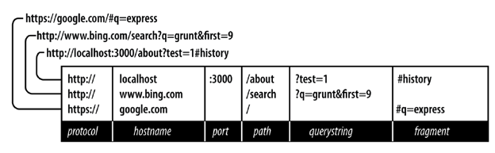

# labo 1: hfdst 1.1 &gt; 1.3

## 0. installatie

### bash terminal \(voor Windows gebruikers\)

Volg deze instructies \(de lijn die je moet copy pasten staat onder de afbeelding\)



```text
"terminal.integrated.shell.windows": "C:\\Program Files\\Git\\bin\\bash.exe"
```


### Node Exec \(extensie in Visual Studio Code\)

### integrated terminal \(in Visual Studio Code\)

* [https://code.visualstudio.com/docs/nodejs/nodejs-tutorial\#\_integrated-terminal](https://code.visualstudio.com/docs/nodejs/nodejs-tutorial#_integrated-terminal)


### 1. opfrissing van JavaScript

Start de Node.js CLI \(via node ****zonder argumenten\) op. Probeer hier een aantal JavaScript statements uit:

* Maak een variabele a, b, c aan en initialiseer deze met een waarde \(gebruik let, niet var!\) en tel deze bij elkaar op \(= eerste keer console.log\)
* Maak een array myArray\[\] en voeg daar een aantal getallen aan toe. Tel alle getallen van deze array bij elkaar op.
  * Maak hiervoor een gewone **for** lus \(= tweede keer console.log\)
  * Maak ook gebruik van het **forEach\(\)** statement \(=derde keer console.log\).
* Verlaat de [REPL tool](https://www.tutorialspoint.com/nodejs/nodejs_repl_terminal.htm) en doe het bovenstaande in een eigen index.js bestand in Visual Studio Code. Als je hier output wil hebben zal je gebruik moeten maken van console.log statements.
* Gebruik de debugger van Visual Studio Code en zet een breakpoint ergens in de for lus en stap daarna doorheen de code. 

### **2. JSON modelleren**

Maak een JSON-bestand waarin je een winkelmandje modelleert:

* Het bevat een array van producten.
* Een product bevat de volgende eigenschappen:
  * naam
  * beschrijving
  * prijs
  * stock

**Er moeten minimum drie producten in het winkelmandje liggen en één van de producten heeft geen beschrijving.**

* Installeer JSONlint en kijk na of jouw json-bestand voldoet aan de specificaties:

```bash
npm install -g jsonlint
jsonlint shopping.json
```

ter info: -g = global install  
OF gebruik de online JSON-validator: [https://jsonlint.com/](https://jsonlint.com/)

### 3. eenvoudige webserver met JSON

Interessante functies die eventueel nodig zijn voor dit labo: [JSON.stringify\(\)](https://www.w3schools.com/js/js_json_stringify.asp) en [JSON.parse\(\)](https://developer.mozilla.org/en-US/docs/Web/JavaScript/Reference/Global_Objects/JSON/parse)  
Je kan in Node.js heel eenvoudig een webserver maken. Maak hiervoor eerst een bestand index.js aan.

```javascript
const http = require('http');
const server = http.createServer((request, response) => {
    response.writeHead(200, {'Content-Type':'text/plain'});
    response.write('Hello World');
    response.end();
});

server.listen(3000);
```

* Pas deze webserver aan zodat deze JSON kan teruggeven. Je kan een lijst van content type's [hier](https://developer.mozilla.org/en-US/docs/Web/HTTP/Basics_of_HTTP/MIME_types/Complete_list_of_MIME_types) vinden.
* Pas deze webserver aan zodat het op een andere poort runt \(1337?\)
* Retourneer een JSON-object dat je voornaam en achternaam bevat als je naar http://localhost:1337 surft. Hou er rekening mee dat de write-functie alleen strings aanvaardt, dus het object zal nog omgezet moeten worden.
* Ga op zoek naar headers in het request-object, naar informatie over je browser en je operating system. Geef dit ook mee terug in het JSON-object. _\(Je kan ofwel via de debugger het request object inspecteren of gewoon het object afprinten via console.log\)_
* Hou een teller bij hoeveel keer de pagina is geladen en geef ook dit mee in de response van je http-server.


