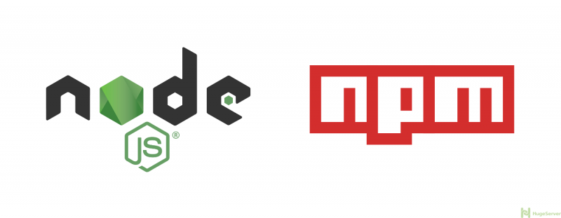

# 02. Node Package Manager \(npm\)

Samen met Node.js werd npm \(Node Package Manager\) geïnstalleerd. Dit laat ontwikkelaars toe om externe packages te installeren die nieuwe functionaliteiten aan een project kunnen toevoegen zonder dat je hiervoor dus zelf code moet schrijven. Een grote bibliotheek van opensource packages staan op [npmjs](https://www.npmjs.com/) en deze kunnen gebruikt worden om een eigen Node.js-applicatie te maken.



## package.json

### npm init

Met het volgende commando te typen in de terminal `npm init` wordt een package.json bestand aangemaakt, waarvan hieronder een voorbeeld.

```javascript
{
  "name": "parktrack",
  "version": "1.0.0",
  "description": "",
  "main": "index.js",
  "scripts": {
    "test": "echo \"Error: no test specified\" && exit 1"
  },
  "author": "student AP",
  "license": "MIT",
  "dependencies": {
    "body-parser": "^1.18.2",
    "express": "^4.16.2",
    "http": "0.0.0",
    "https": "^1.0.0",
    "json-stringify": "^1.0.0",
    "net": "^1.0.2"
  }
}
```

voorbeeld van package.json


## npm + Node.js

Hier wordt de package.json \(houdt dependencies bij\) gecombineerd met algemene info over de applicatie. 

Bij elke installatie van een npm, komt wat je installeert in de node\_modules map terecht. Bij `npm install --save` wordt de package en zijn versie ook in de package.json gezet als een dependency.  
Bij het verwijderen van de node\_modules map kan aan de hand van de dependencies in de package.json alles vlot terug geïnstalleerd worden met `npm install`.  Concreet maakt npm een verbinden met het internet om de packages te downloaden die beschreven staan die beschreven staan in de package.json.  
De geïnstalleerde packages kunnen nu gebruikt worden met de `require` functie. Documentatie omtrent de packages zijn te vinden op [npmjs.com](https://www.npmjs.com/)

```javascript
const http = require('http');
const search = require('youtube-search');

const opts = {
  maxResults: 10,
  key: 'KEYGOESHERE',
};
let output = '';
search('Antwerpen stad', opts, (err, results) => {
  if (err) return console.log(err);
  results.forEach((element) => {
    output += ` <a href='${element.link}'>${element.title}</a> <br/> `;
    console.log(output);
  });
});
const hostname = '127.0.0.1';
const port = 3000;

const server = http.createServer((req, res) => {
  res.statusCode = 200;
  res.setHeader('Content-Type', 'text/html');
  res.end(output);
});

server.listen(port, hostname, () => {
  console.log(`Server running at http://${hostname}:${port}/`);
});
```

